# Homework #2: Discrete-Event Simulation Assignment

Oddny H Brun
deadline 28 Mar 12:00 am, additional days used 3
extra credit: a pseudo random generator added to part 1

##Part 1: Empirical Test of Randomness

### (a) The Randomness of Five Random Number Generators

Five different generators were tested by generating uniformly distributed random numbers on[0, 100]. These generators were called by a C++ program by:

- mt19937_64

- knuth_b

- minstd_rand

- ranlux48

- sobol.

The number of observations, N, generated was 100,000. For each of the five generators, we generated five set of observations, that is, 100,000 times five, and calculated the mean and variance. These five by five sets of observations are named V1, ..., V25 in the order of the list of generators above.

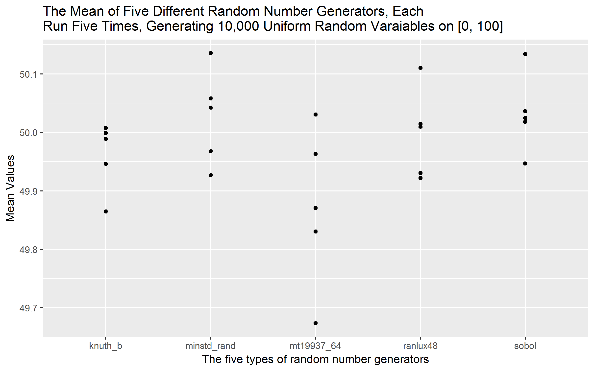

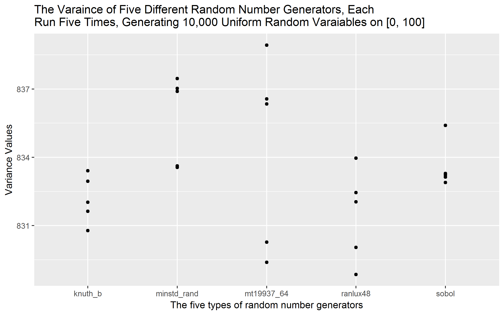

The conclusion based on the generated observatios is that mt19937_64 generator is the least consistent generator with respect to the mean and variance of the observations, (Figures 1 and 2). The mean and variance values varies both within the same generators as well as between generators. In general, comparing across the five generators, they are more consistent than the result of the five sets of obervations from the mt19937_64 generator compared to each other. The answer to what generator generates the most true uniformly random observations is not possible to deduct from this experiment despite of the statstical analysis provided below. But both the knuth_b and the sobol generators seem to come closer to the theoretical mean and variance of a uniform distribution on [0, 100].

A statistical test of the variance within the groups (that is, observations generated by the same generator) compared to the variance between groups did indicate that there is difference between the two. A Fisher F-test was used for this purpose. This supports the visual impression (Figure 2) where the range of the variances for the observations generated by the mt19937_64 of 9.5 is larger than in any of the other groups. The sobol generator produced the smallest range of variance, which was 2.5, slightly smaller than the data generated by the knuth_b generator. In theory, the variance of a uniformly distributed set of observations on [0, 100] is 833.333. The varaince of the mt19937_64 observations closest to this number was 836.3451, a difference of 3.0121. All the other generators produced some sets with variances less than one apart from the theoretical one. Same seem to be the case for the means in the sence that the observations generated by the mt19937_64 generator show the largest range in mean values. The knuth_b has the smallest range in mean values. The mean of a uniformly distributed set of observations on [0, 100] is 50.0. The knuth_b and the sobol generators seem to produce means closest to this value (ref. Figure 1).

Further, the two sets of observations with the smallest and the largest variance, V3 and V5, respectively, generated by the mt19937_64 generator were tested by the Kolmogorov-Smirnov Test (KS test) whch indicates that the probability of the sets representing the same uniform distribution is rather small. In fact, the KS test indicates that the probability of these two sets of observations coming from the same uniform distribution is less than the probability of each them representing the same uniform distribution as the sets of observations generated by the ranlux48 generator, which contained the set observations with the least variance (referred to as the V19 set). A graph of the cumulative densities (CD) for the three data sets V3, V5, and V19, together with a theoretical uniform CD function indicates such differences between the functions, ref. Figure 3. The theoretical uniform distribution was simply constructed by assigning the probability of 1/100 for each of the 100 positions on [0, 100].

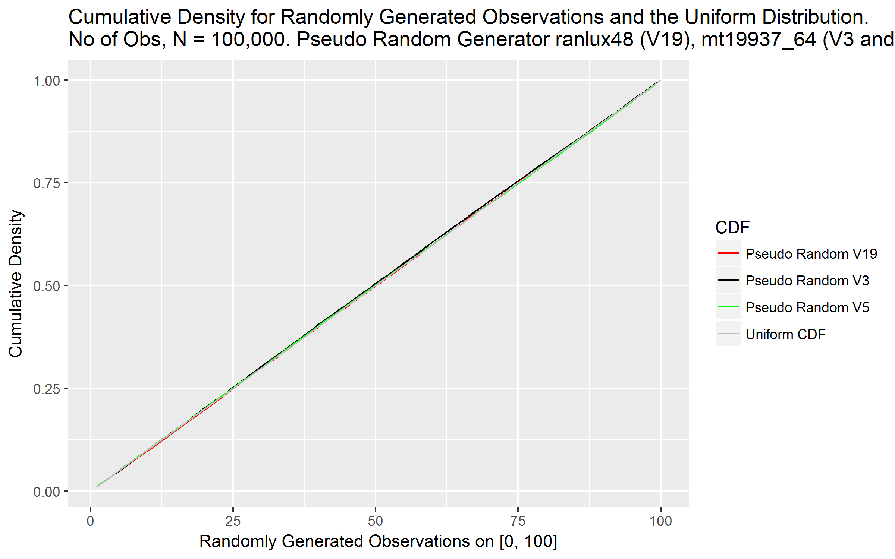

There are additional statistical measures that might be used for evaluating the randomness of the generated observations. Among those are the skewness and the kurtosis of a ditribution. The skewness is a measure for symmetry and kurtosis is a measure for the shape of the distribution's tails and hence a measure for outliers. For a uniform distribution, the skewness is given to be zero and the kurtosis -6/5, that is -1.2. Analysing these 25 sets of observations did not provide additional information in order to conclude if any random generator was better than any of the other ones.

The largest skewness value was for the mt19937_64 V3 observation set with a value of .017, where all the other sets had skewness of about .008 or less. The kurtosis values were all within .001 of 1.8.

As no absolute conclusion is possible based on the observations, any future selection of random number generators may be based on the particular simulation task at hand and the sensitivity of the genreated data related to the simulation results.

### (b) Varying the Number of Observations

The five random number generators used in (a) was used to generate uniformly distributed observations with number of observations, N, equal to 500, 1000, 10,000 and 1000,000, respectively. Only one set of observatios was generated per N and per random number generator, as oppostite to the five sets each used in part (a). For each random number generator, the means and variance were compared with the results from part (a) to check if they were within the ranges of the means and variances of their respective group. 

The effect of increasing N above 100,000 did produce uniform random observations with a mean of 50.0 and variance of 835.21 by all the five random number generators. So while the mean values were equal to the mean for such a distribution, the variances were still a little higher than the uniform distribution on [0, 100] should be, 835.21 vs. 833.33. The effect of reducing N was observed by both mean and varaince values deviating from what was the casee for N=100,000. 

For the sobol generator, all the means were within the range from part (a) where N= 100,000 was used, but the variance for N=1000 was slightly higher than the max variance from (a), 841.0 vs. 835.4, and the variance for N=10,000 were slightly lower, 829.4 vs. 832.9, than the min variance from (a).

The ranlux48 generator which generated observations with a rather small range in variance values for N=100,000, did result in the largest deviation in variance vlues as N was decreased to 1000 and 500, respectively. Figures 4 and 5 shovw the range of means and variances, respectively for the case (a) with N=100,000 and case (b) with N less or equal to 10,000 observations.

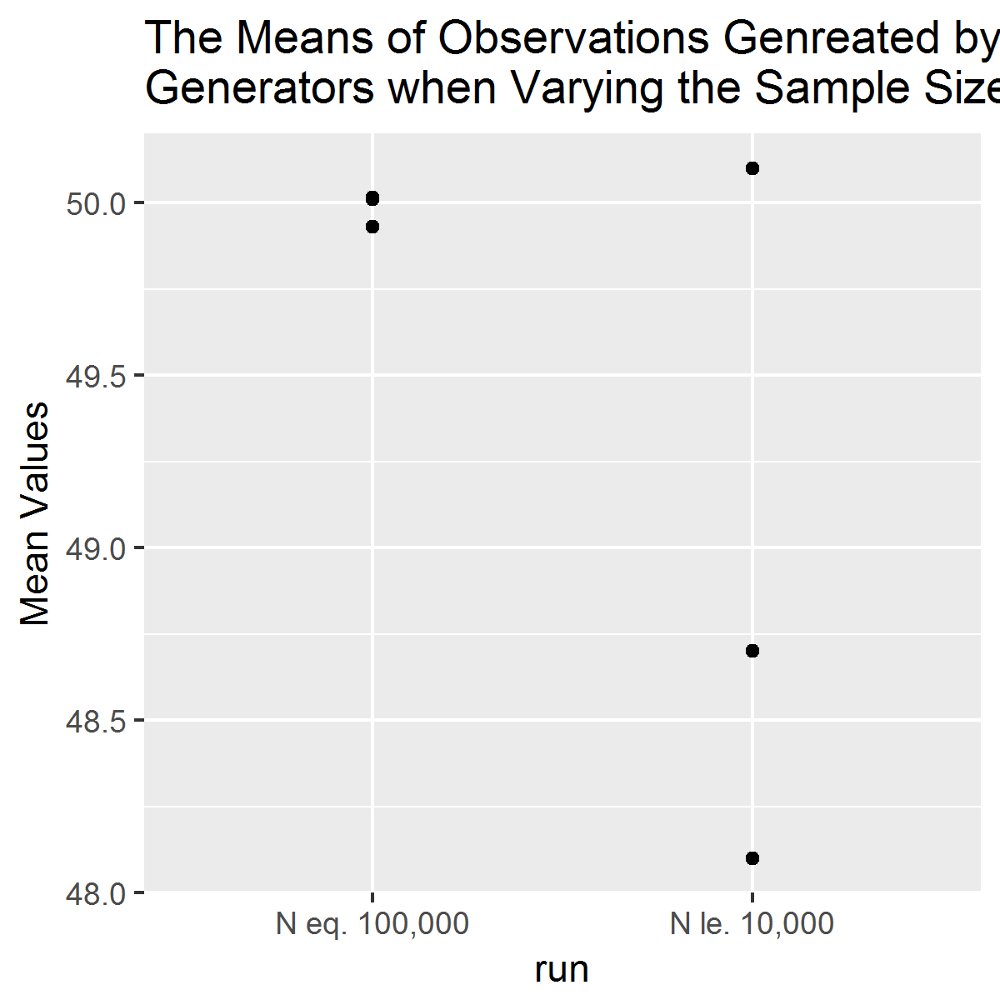

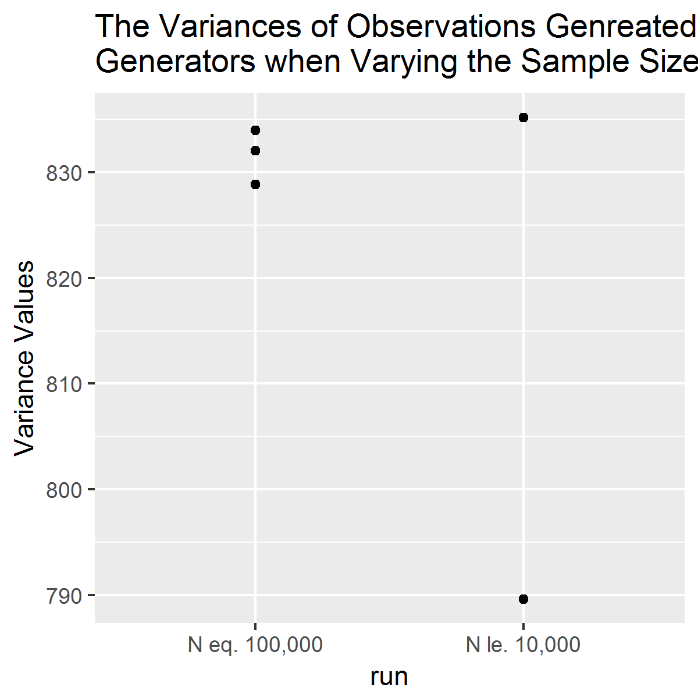

In general, N values of about 500 and 1000 should be expected to be too low for a distribution over a domain of the size used here as it results in only a few observations in each of the 100 partitions. 

### (c) Evaluation of Different Distributions 

The objective is to see if the findings from the generation of uniform distributed observations in terms of means and variance seem to be valid also for the results of other randomly generated observations. We decided to use teh following five distributions:

- Gaussian(50, 28.86751)

- Exponential Distribution(.02)

- Poisson Distribution(50)

- Gamma Distribution(3.7, 14.3)

We decided to use the mt19937_64 becaue it resulted in observations with larger range in mean and variance for the uniform distribution than the other generators. For each distribution, we generated five sets of data each of 100,000 observatoins, just as in part (a).

Before presenting the results, it is important to draw the attention to some factors that limits the comparison between distrbutions. First of all, only the Gaussian and the Gamma distributions allow for both mean and variance to be set for the generations of observations. Furthermore, the Gamma distribution parameters were picked by a trial and error approach, trying to get means and variances close to the unform distribution used in part (a). For the Poisson distribution, the variance equals the mean, and hence generating observations with variance in the order of 833 as was the case in part (a), would result in a mean of the same order. Hence, we decided to use a mean of 50 for this distribution. In other words, we decided to focus on generating observations with mean values about 50 for all five distributions, resulting in large range in variance values between the distributions. The observations for the Poisson distribution had a variance in the order of 50, the Exponential had a variance in the order of 2500, and the Gamma distributed observations in the order of 750.

As stated above, the mt19937_64 generator produced uniform distributed observations with a larger mean and variance range than the other generators. Of these four additional distributions, only the exponentially distributed observations had mean and variance ranges of this order, as wella as the variance of the Gamma distributed observations. The Poisson distributed observations had the least range in mean and variance values, the Gaussian observations had the second lovest ranges in mean and variance. These results are presented in Table 1 and the folowing two graphs.

![Tal]ble 1 Mean and Variance Values](images/distr_mean_var.png)

###(d) Evaluating Random Number Generators vs. Number of Observations, Uniform Distribution

Randomly generated observations for the uniform distribution were generated on [0, 1] for each number generator used in (a) pluss the ranlux24 generator, and for number of observations N of 500, 1000 and 10,000. Two sets of data for each case were generated and displyed in a unit square. While there sem to be visual differences, these differences are not quantified. The mt19937_64 may seem to have larger areas without any observations in the case of N=500 than the other generators, but for higher N values this does not seem to be the case. In the cases of N=10,000, there might be indications of some curvy lines for all of the squares. A quantification of such potential patterns would be important in order to confirm or dismiss these observations.  

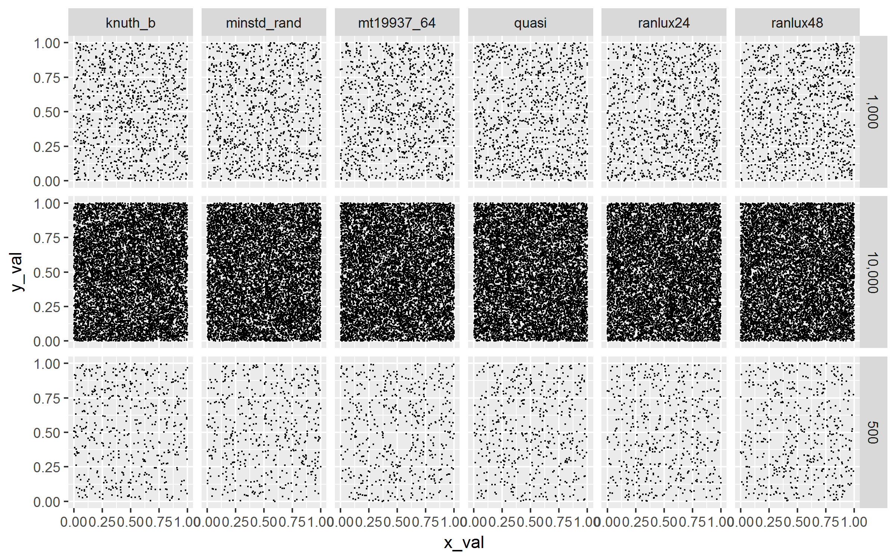

###(e)Two Dimentional Random Observations for Five Distributions

The same distributions used in (c) were used to generate two dimentional data and displayed on a unit square. It is important for teh results to keep in mind the comments from (c)regarding the limitation for some of these distributions to set the variance values. For those reasonsfocus the comparison of results within distributions may be more relevant than among distributions. Within distributions, there seem to be consistentcy in terms of shape and location. The exponentioal distribution seem to have the majority of observations in the lover left corner (0, 0) location. Teh Gaussian distribution is located around (.5, .5) as expected for this distribution with expectation .5. The Poisson distribution clarely display a pattern of straight lines through the otherwise dense observation area.  

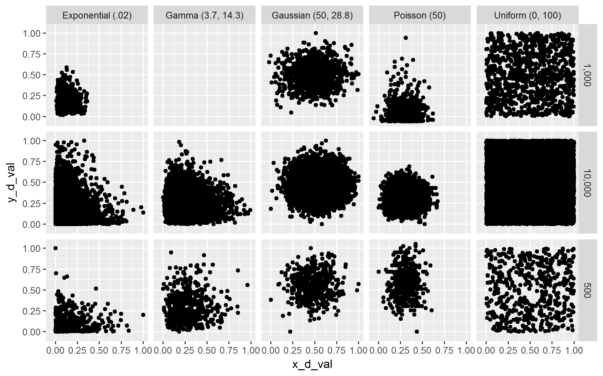

###(f) Random Number in the Unit Circle

#### Random Number in the Unit Circle by Random Number Generators

The six random number generators used in part (a) were used to generate two uniformly distributed varables for numbers of observations N equal to 500, 1000 and 10,000, respectively, The two varaibles, a radius of length between zero and one, and an angle between zero and 360, were used to calculate the respecitve two dimentional x and y values by:

(i)		x = cos(angle) * radius
(ii)	y = sin(angle) * radius

The results are presented in the below graph. In all cases, both with respect to type of number generator and number of observations used, the data tend to be more consentrated as one gets closer to the center of the circle. In other words, they do not look like they are uniformly distributed on the circle's area. This could be an effect of the transformation from polar to cartesian. The  uniformly distributed datapairs (r, angle) are most likely not uniform in the (x, y) form as this transformation is not a linear transformation. This can be illustrated by comparing the histograms of the observations as in the below graphs where the y-component of the uniformly generated data transformed by the above formula,  p_y_u_10000 = sin(angle) * radius, are displayed, and the originally uniformly distributed observations y2_1.

The unit circles in the below graph are unfortunately displayed with an oval shape. This is a display issue, an not a result of the observations themself being of oval nature.

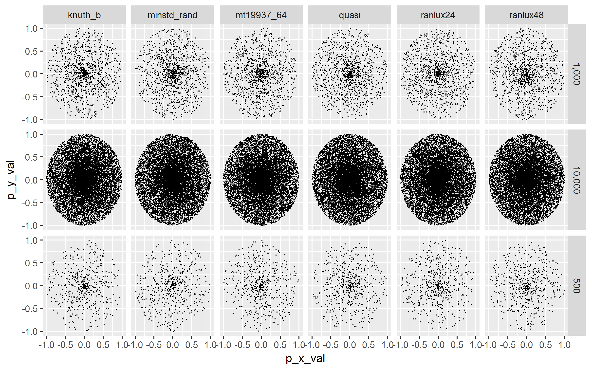

![Histogram of Uniformly Generated Data on [0, 1]](images/unif_hist10000.png)

#### Random Number on the Unit Circle by Distributions

The same distributions and random number generator analysed for unit square were used to generate random observations for a unit circle. As with the case of random numbers from the uniform distribution to the unit circle above, the generated data were generated as radii and angles and transformed to cartesian coordinates. In addition, the distribution parameters were taken into consideration by:

- the Gaussian Distribution(180, 28.8)
- the Poisson Distribution (180)
- the Exponential Distribution (1/180)
- the Gamma Distribution (12.7, 14.3) 

These parameters were choosen to reflect as close as possible the parameters for the uniform distribution,  but without trying to match the variances any closer. 

The main conclusion from this analysis is to make sure that the randomly generated observations represent the task to be evaluated. Representation of randomly generated observations on a unit circle area without any transformations from polar to cartesian representations, will still be of the same distribution as original data (as in (e)), they would only be limited by a circle, rather than a square. As soon as a nonlinear transformation is performed, the distribution of the transformed observations are different from the original ones. The characteristics of the new distribution, if it exists, would have to be anlaysed to see to what degree the observations represent the task at hand. Such an nalysis is not included here.

Again, the transformation from polar to cartesian coordinates produces observations with different distributions than the distribution the observations has before transformation. Looking at the below graph, the results of the transformed Gaussian observations seem to be mostly distributed to the left half of the circle. The same seems to be true for the exponential and the gamma distributions as well, while the Poisson, and in particular the uniform distributions are more balanced around the center of the circle, except for  the Poisson observations for N=500. These are also located in the left half plane.

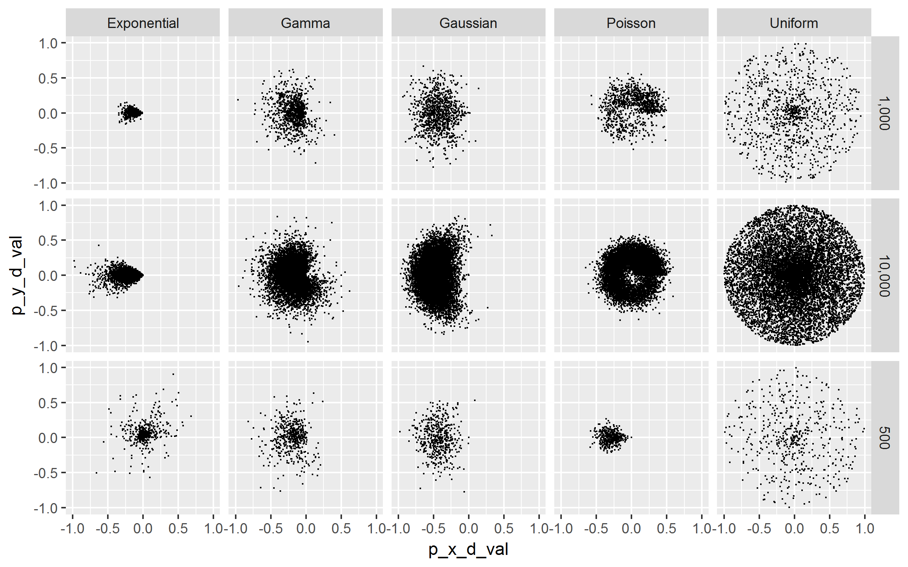

##Part 2: Snakes and Ladders

###(a) Null State Game 

The file transitionMatrix.h populates the 101 by 101 probability matrix by using a for loop for the 101 -6 rows. The last six rows are populated manually. The program has a commented-out section that were used to verify that the sum of each 101 rows each adds up to one, and that no negative values are found.

###(b) Simulation and Analysis of the Null State Game

In the file test_markov.cpp a vector were implemented to represent the probability of a player being at a certain position after each roll, starting from position zero. This vector is updated per roll by a vector*matrix multiplication. The vectors representing the resulting probabilities after each roll is saved in a matrix V_vectors of dim size = 101 by 101. (This could have been size by ROLL, where ROLL = number of rolls). In other words, an element V_vectors(i, j) describes the probability of being in position j after i rolls. Hence, the sum of the elements in a column is one for each column. (With 100 percent certainty you have to be somewhere if you did not quit the game). 

For the null state game using a Markov process, the max number of rolls to get to position 100 is 36. The minimum number  is 17, which is equal to rolling six for 16 consecutive times and then rolling 4 or higher at the 17th roll. Further, by identifying the largest probability of being in position 100, which is the number of rolls we should expect to do to end the game is identified. The probability of reaching position 100 is highest for roll no 29, p=0.151241, ref. figure below.

file:///C:/Users/Oddly/Documents/GitHub/IDS6938-SimulationTechniques/prob_100.png

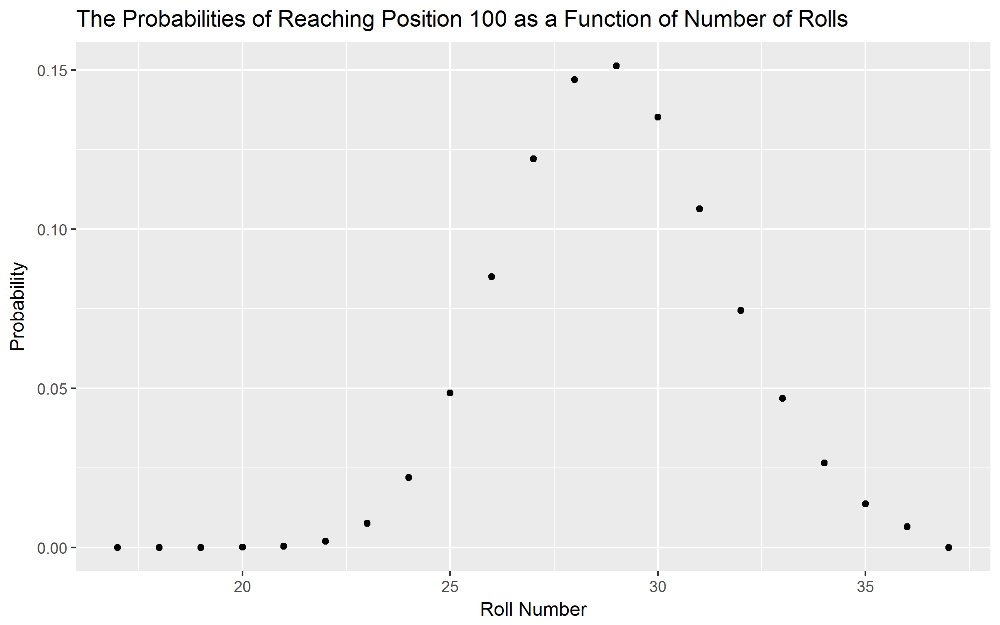

The below included graph shows the probabilities for each position when rolling one, two, three, and so on up to and including 38 rolls rolls. It gives an interesting general presentation of rather high probabilities per position for the first rolls, then gradually reduced probabilities until position 100, which reaches the probability of about .15 for rolls number 28, 29, and 30, with probabilites of 0.146937, 0.151241, and 0.13523, respectively. This is what should be expected if we think of getting on an average 3 for each roll and having 100 positions.

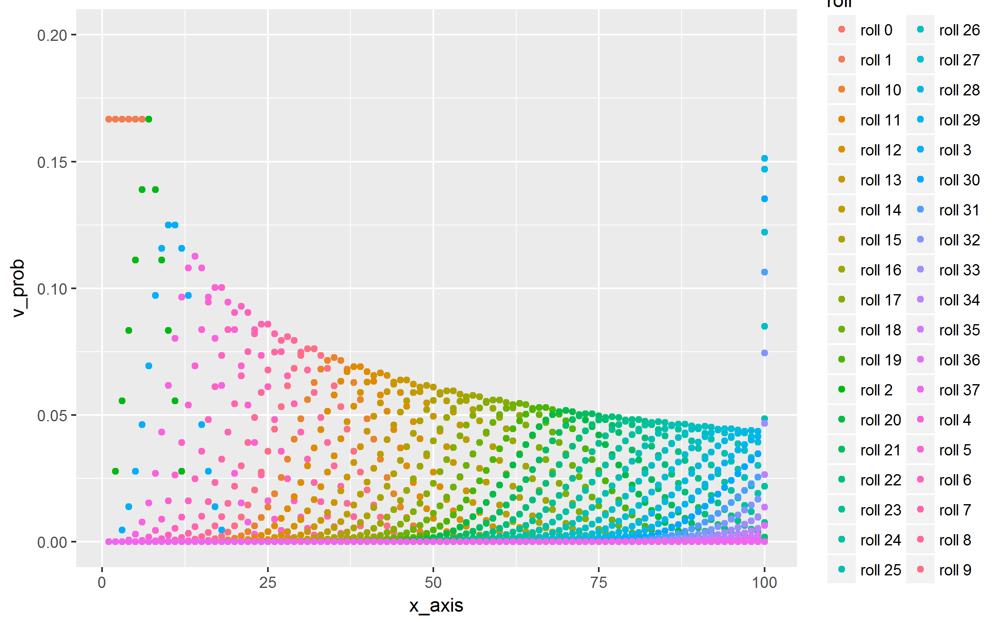

###(c) Results with Snakes and Ladders Implemented

Snakes and ladders were implemented by altering the transition probability matrix in the TransitionMatrix.h program file. All rows were checked for negative values and sum by the same code as before.

Implementing the snakes and ladders changes the probabilities for getting to the different positions and the number of rolls to get there. The graph showing the probability of being in a certain position for the different number of rolls illustrates how the probabilities of getting to increasingly higher positions decreases with the snakes and ladders compared to without, except for the positions with ladders leading up to them. As an example, the probability of getting to positions in the forties and on, are all below .05 independent of number of rolls. For the null state game (i.e. without snakes and ladders), this probability was .05 and higher till about positoin 75, to continue to stay just below .05 for the remaining positions. But with the snakes and ladders implemented, reaching these later positions continue to have a probability of well below .025, except for the ones with ladders and the winning position. These states reach probabilites in the range of .025 to .0375.

As expected, with the snakes, there is a higher probability of being at lower positions after a higher number of rolls than without the snakes, as shown by the more diverse mix of colors and lack of smooth pattern compared to the graph above for no snales and ladders.

With the snakes & ladders implemented, the maximum no of rolls to get to position 100 is 76 with a probability of .00195963, and the minimum number of rolls is 6, with a probability of  0.00042867. 
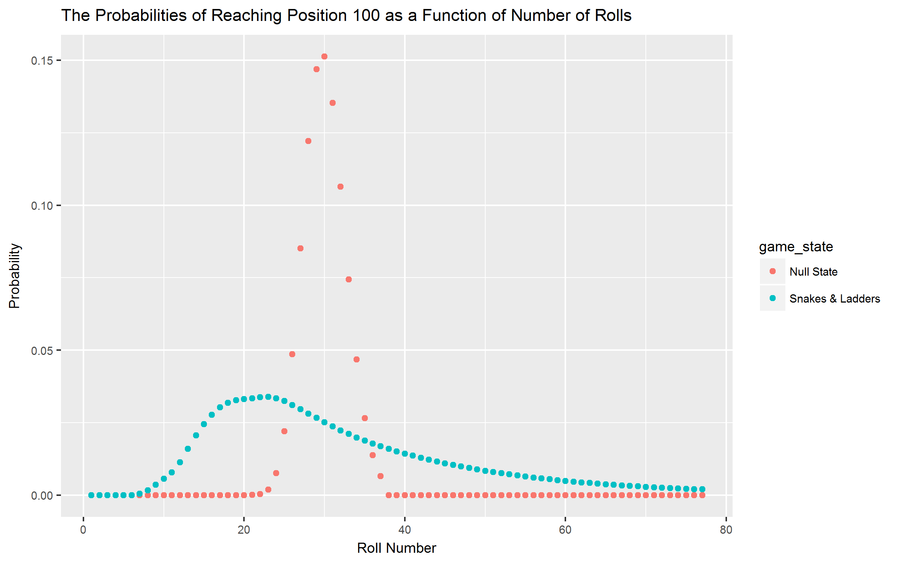

Despite the two scenarios having highly different probability densities, the expected number of rolls to reach position 100 does not differ much, with 27 for the snakes & ladderds scenario and between 28 and 29 (28.4)for the null state game scenario.

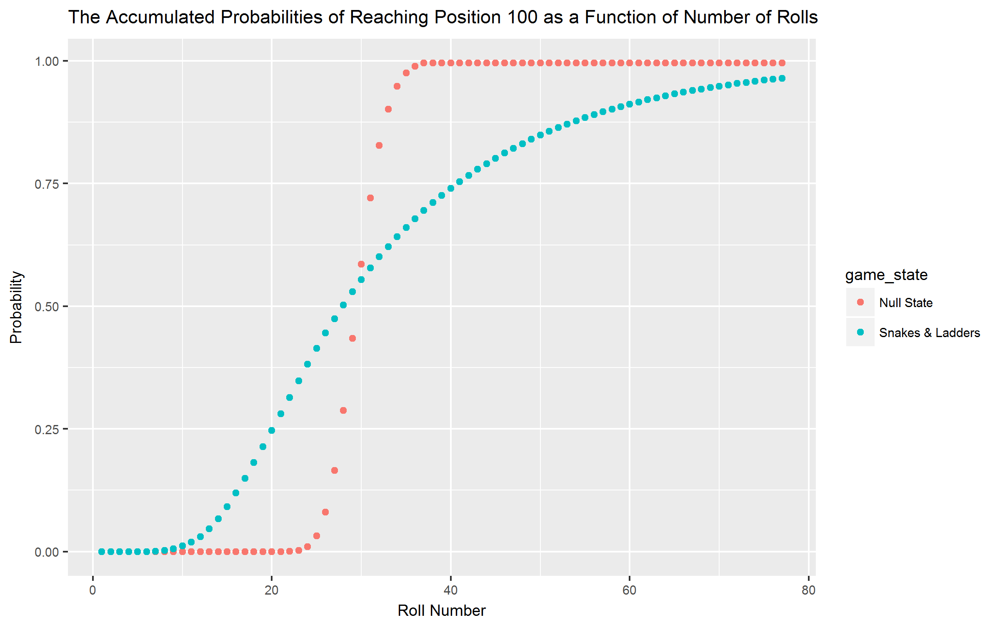

A Monte Carlo (DTMC) simulation was performed with the same snakes& ladders game where both number of rolls and number of attempts (N) were varied. This exercise demonstrated both the effectiveness as well as the uncertinties and effort that are part of the nature of a Monte Carlo simulation compared to the Markow process. The process was simulated with the expected number of rolls, 27, to get to position 100 for attempts N with values of 10, 11, ...., 27. In the Markov prossess approach, this probability is about .5. The probability of reaching position 100 in the DTMC is based on N. Hence, a DTMC simulatin results of reaching position 100 with 27 rolls and 20 attempts resulted in probability a probability of .4, but when run repeatedly for ten times, the average probability was .27. In order to get to a probability of .5, the attempts had to be at least 26.

Again, this underline the importance of number of attempts to be used in order to be able to draw conclusions in the case of Monte Carlo simulations.

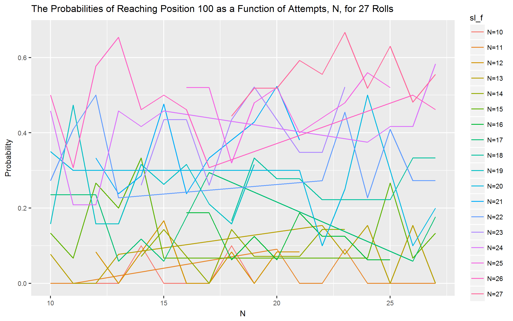

###(d) Is it Really a Game?

A game may be defined several ways. In the Merriam Webster dictionary, it is defined related to strategy, or engagement for amusement, among others. By the first definition, the snalkes& ladders is not a game, as there is no strategy involved. But by the second one, it is a game. It is the kind of game I enjoy when my brain needs a break, even thoug I might rather do asimple cross word puzzle. But for strategy development, I would not chose this game.

##Part 3 Discrete Event Simulations - Queue Simulations

###(a) Create Airport Scenario and ###(b) Check for Within Error Range

The airport scenario was implemented in the main.cpp file with server rates mu as given. Only the first entrance, the ID check and teh boarding was set to accept new arrivals. The arrival rate lambda for the security gates was set to one third of the check in service rate (cur_lambda/3, which is an integer division in C++). As cur_lambda increases, the number of passengers through the airport increaes, and hence the server utilization rates improves. At cur_lambda = 15, the server utilization rates went up to about 50%. At cur_lambda of 33, the number of arrivals were 75,764 whereof only three passengers were not boarded. Service utilization was about 62% in the ID check and 35% in the boarding. The difference in these two rates are due to the higher capacity in the boarding (mu = 80) vs. in the ID check (mu = 53). This is also confirmed by the mean waiting times of .007 vs. .031 for the two services, respectively. 

Setting the parameters and designing the layout of such a scenario is well demonstrated in this example. It emphasis the balancing issue one has to deal with in the case of a MM1 process where server rates higher than the arrival rates. 

When checked towards the Anylogic model results with the same set of arrival and service (mu and lambda) parameters, that model did board about 500 passengers in a one minute run. Here, for a cur_lambda of 12, 1812 passengers got boarded. While these two approaches may not be comparable when it comes to number of pasengers booked, as Anylogic is driven by a clock and Queues (in C++) is driven by cur_lambda, the point of server utilization and boarded passenger are in both cases of high interest.

###(c) Calculate performance Measures 

Performance measures were implemented in mm1_queue.cpp by the following formulas:

	  expected_server_utilization_ = lambda_/mu_;
      expected_idle_prob_ = 1-expected_server_utilization_;
      expected_queue_length_ = lambda_ - mu_;
      expected_number_customers_ = expected_server_utilization_/(1-expected_server_utilization_);
      expected_waiting_time_ = expected_server_utilization_/(mu_ - lambda_);
      expected_response_time_ = 1/(mu_ - lambda_);

These were the measures used in the above discussion regarding design critereias for queue processes. 

###(d) Useful Statistics and Analysis of the Airport Scenario

The airport scenario is analysed based on the differnt servers' utilization rates and queue lengths. The service utilizations rates are all .62 and lower. As the boarding area has the largest capacity of handling traveelers, this is also the area with lowest utilizations rates. The graph below shows the different servers' utilization rates as a function of arrival rate cur_lambda. 

Queues are longest at the ID check as expected since this is the area of lowest capacity, also indicated by the highest server utilization rates. 

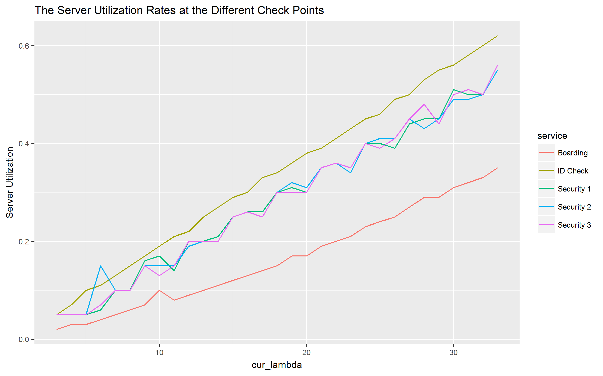

###(e) Analysing Airport Scenario with Anylogic

The airprt scenario was created and simulated by use of Poisson(.5) distributions in order to match the scenario given in (a). The results of an one minute run is given in the below picture which shows 494 passengers onboard. Security gate one two is moving slower than number three despite the same parameter settings. A few connector error were identified as we ran the model. All connectors were verified and it does not seem to influende the results of the simulation. It might be the not used connectors in the splitter and the assembler, even though these are set to zero output and zero input, respectively. 

The C++ model seem to have a better result in getting the travellers boarded compared to teh Anylogic model, despite teh same parameter settings. In the C++ model, with about 1500 travellers arrived, all except for two got boarded. It would be necessary to check  if there might be some timing issues that does not make the models comparable in this aspect. 

