# Homework 3 : Agent based Simulation Assignment

## IDS6938-Simulation Techniques - [University of Central Florida](http://www.ist.ucf.edu/grad/)
by Oddny H Brun

### Part 1 Behaviors

#### (a) Derivative

The derivatives are implemented using Eulers method. The first two, deriv[0] and deriv[1] represent the change in length traveled by the agent per time step, dx/dt = v.  The other two, deriv[2] and deriv[3] are acceleration, the change in velocity per time step dv/dt = force/mass = acceleration for linear and angular movement of the agent, respecitvely. The Euler method seems to give reasonable results in terms of linear movement. I suspect that a higher order method like the midpoint method or the Runge-Kutta 4 method might have given more narrow turns whenever an agent changes direction as well as a more straight walk compared to now where the agent shows tendency to zig-zagging a little. This suspicion has not been checked or attmpted quantified in this work.

The derivative were defined as:

		deriv[0] = state[2];
		deriv[1] = state[3];
		deriv[2] = input[0]/Mass;
		deriv[3] = input[1] / Inertia;

With these definitions for the derivative, only deriv[0] and derv[1] changes as the program execute. Deriv[2] and deriv[3] are constants based on the initial settings for mass, momentum, inertia and calculations of input[0] and input[2]. The agent moves to and from target in a sliding manner without moving its feet. Only a change in these input values would cause changes to deriv[1] and deriv[2].  When deriv[2] is changed by either adding state[2] or vd to it, the agent walks with its legs. In the case of adding state[2], the speed is much slower than when vd is added. In both cases, adding the velocity represented by state[2] or vd is assuming time is one in order to become an acceleration term a=v. 

In order to achieve smooth movements, the agents' mass and inertia were adjusted along with force and torque. Too much torque resulted in the agent turning back and forth around its own axix as it walked in the commanded direction. Too high inertia related to torque resulted in wider turns as it was circling around target in a seek as wellas when changing directions due to changing behaviors. I settled at torque per inertia of 8/6, a force per mass of 9/1.75, and velocity Kv of 3. Force/mass and velocity was increased and decreased to increase/decrease the walking speed of the agent.

#### (b) Individual behaviors

Seek

Seek was implemented by calculating the desired velocity between agent's current position, GPos, and its target, goal, and desired angle, thetad, which is the angle between current velocity and desired velocity to find the steering velocity, the correction needed in order to react target. When executing, the agents seek the target, and when reaching the target, they continue to move in circles around the target. They also respond to the target being moved by seeking the target in its new location.

Flee

Flee was impleented by the same algorithm as for seek, except for adjusting the desired angle thetad by 180degrees. When executed, the agents walk away from target and continue to walk until reaching the edge of the flat "earth". They also respond to the target being moved by changing direction if new target gets located in front of where they were fleeing.

Arrival

The algoritm for arrival is equal to the seek algorithm until the agents come within a set distance from the target, Aradius. Then the agents'sped is slowed dovn by a factor of either KArrival or a factor calculated as its distance Adist divided by 2 times its Aradius, Adist/(2*Aradius). The facor 2 was just to achieve a slower approach than just Adist/Aradius. When executed, the agents behave as for seek behavior until they are a distance Aradus from the target, then they slow dovn as they continue to approach the target. They respond to target being moved by seeking the new target location at "full" speed when further than Aradius away and slow down when being less than a distance Aradius from the target. If behavior is changed to different mode they resume the speed and direction equivivalent for that behavior. Currently, the Aradius is set to 300.

Departure

The algorithm for departure follows the same princilpes as for arrival except for the agetns' speed being reduced as the agents have moved a given distance away from the target. Currently, the distance is set to a radius, Dradius of 1200. when executed, the agents behave like for flee until they reach a distance Dradius from the target, then they slow down by a factor of Ddist/(2*Dradius). The respond to target movement accordingly by  resuming "full speed" fleeing the new target until they are a distance Dradius frorm the target, then they slow teh speed down by teh factor Ddist/(2*Dradius).

Wander

The agent behavior wander was implemented as flee, execpt for the desired angle thetad being randomly created by a uniform distribution on [0, 360] times a noise factor, Knoise. When executed, the agents will change their direction in a seamingly random manner, but this random adjustment is only done once as opposite to having the agents randomly change their directions repetitively without selecting wander repetitively. Their velocity is adjusted by multiplying desired velocity vd by a factor KWnder. All agents wander off in the same direction as the same thetad value is used for all. If time allows, I plan to generate different thetad for each agent. Their behavior is not responding to the target as thetad is independent of the target.

Obstacles

Approach:
- find number of obstales (obstacleNum)
- for each obstacle, find obstacle x and y location and radius (env->obstacles[i][0], env->obstacles[i][1]) and (env->obstacles[i][2]) and check if "cylinder corridor" along the direction of movement is clear
- take corrective action when "cylinder corridor" is not clear.

Cylinder corridor (that is, it is a rectangle bc. this agent moves in 2D, not 3D) is found by calculating the formula of the straight line between agent's location, GPos, and its goal, goal. A radius of length "radius" is added to both sides in x and y direction (this results in the actual radius, the hypotenus, to be a little bigger than the radius specified) of the straight line to define the corridor. Then for each obstacle we check if any area of the corridor is within the obstacle's footprint described by its radius. I check in both x and y direction along the direction of travel. This is conducted by using the x and y position of the obstacle's center and compare to x and y values around that location, using the equation for a circle:

(x-x_a)^2 + (y-y_a)^2 = (r_O)^2, where x_a, y_a and r_a are obstacle x and  y locations, and radius, respectively.

This check is  If obstacle is within corridor, I decrease or increase the angel thetad, respectively. Right now, this angle correction is set to + M_PI/2 if obstacle is in y direction, or -M_PI/2 if in x direction which should be large enough for the one obstacle in consideration. But this factor may be calculated based on the locations of all obstacles within the existing or future corridoes.

Status: Used obstacle no 1 and found it to be within the agent's corridor, but have issues with my "if statement" when checking if any part of obstacle is within corridor, and get aborted during execution. The idea is to expand this algorithm in a double "for loop" that runs through all the obstacles for all agents.

#### (c) Agent Group Behavior

Separation

Step one: Identify other agents within radius of "RNeighborhood" of a specific agent.

I pick agents[0] to be my agent and usees its location to check for the other within a radius of RNeighborhood. This was implemented as a for loop running through all agents (SIMAgent::agents.size(), starting with agents[1] as nr 0 was the one I picked for separation. The distance was calculated as a two dimensional vector representing the distance between agent 0's GPos and each of the other agents' GPos. If the lengt of this vector was less than the RNeighborhood, agent's tmp = (agent's goal - GPos) was normalized and cumulated for each agent within the RNeighborhood. This cumulative distance measure was used to calculate a new thetad degrees for agent 0 to separate from the neighboring agents.

At first when executing the program with a radius, RNeighborhood, of 3.0 and 14 agents, the separation appeared like flee. By increasing the radius to 70. the separation was noticable. One agent clearly seperates away from its nearest agents. As should be expected, the separation effect only takes place if other agents are present in agents[0]'s neighborhood. The separation effect is even easier observed with many agents (60 agents) in an arrival formation as the separation command is initiated.

### Part 2 - Simulating a simple pedestrian flow

#### (a) Subway Enterance

The subway enterance example was created with boundaries, walls, entrance and exit, including faregates before exit to train as shown in the figures below for entrance rate of 1000 per min.

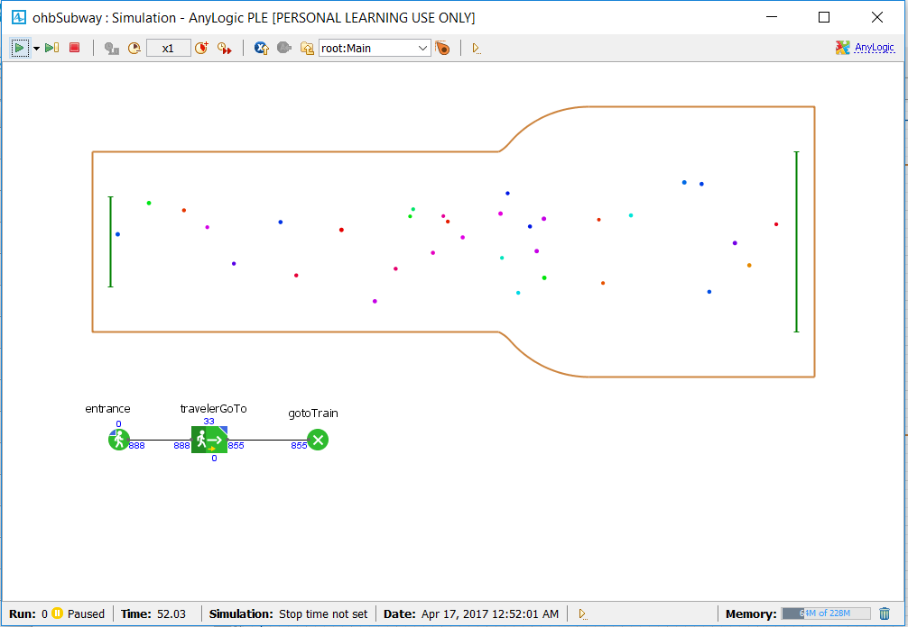

Adding 3d,

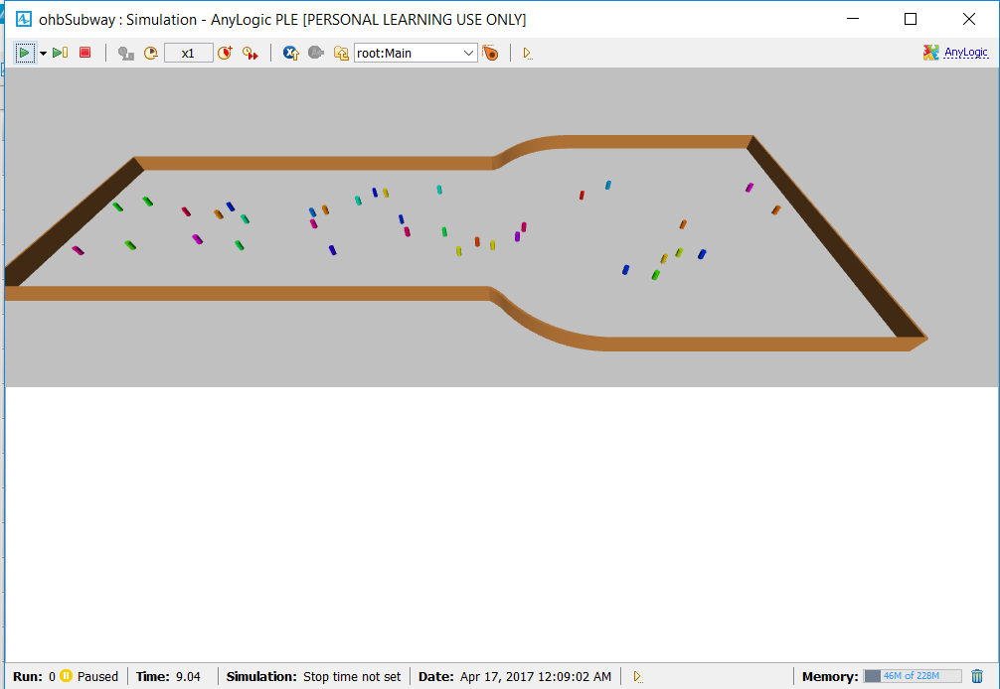

And adding faregates, displayed with density map,

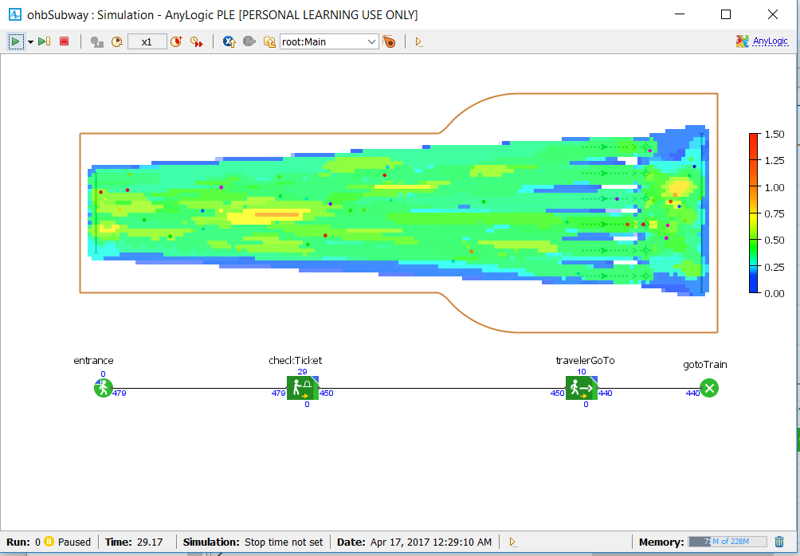

The entrance frequency was increased to 14,000 per minute and the back up and lines were visible as demonstrated in the below two figures:

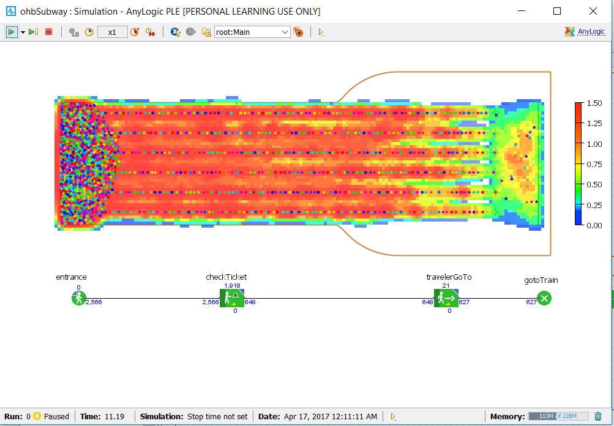

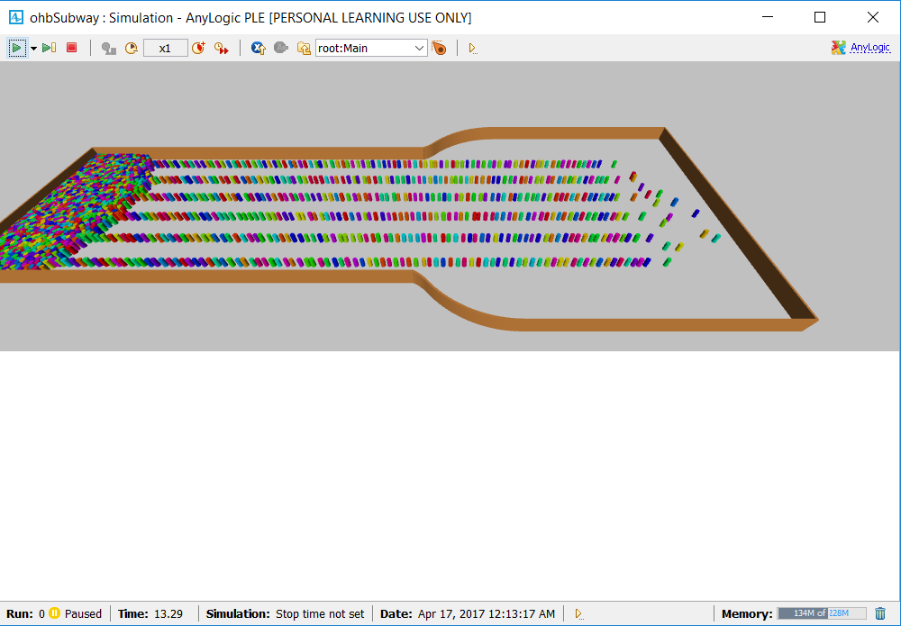

#### (b) Maze

I coipied a maze from www.mazegenerator.net and traced it. The pedestrians are entering at a rate of 1,000 per minute and exiting without showing any area of congestion (queue). The belonging density map is shown in the below figure,
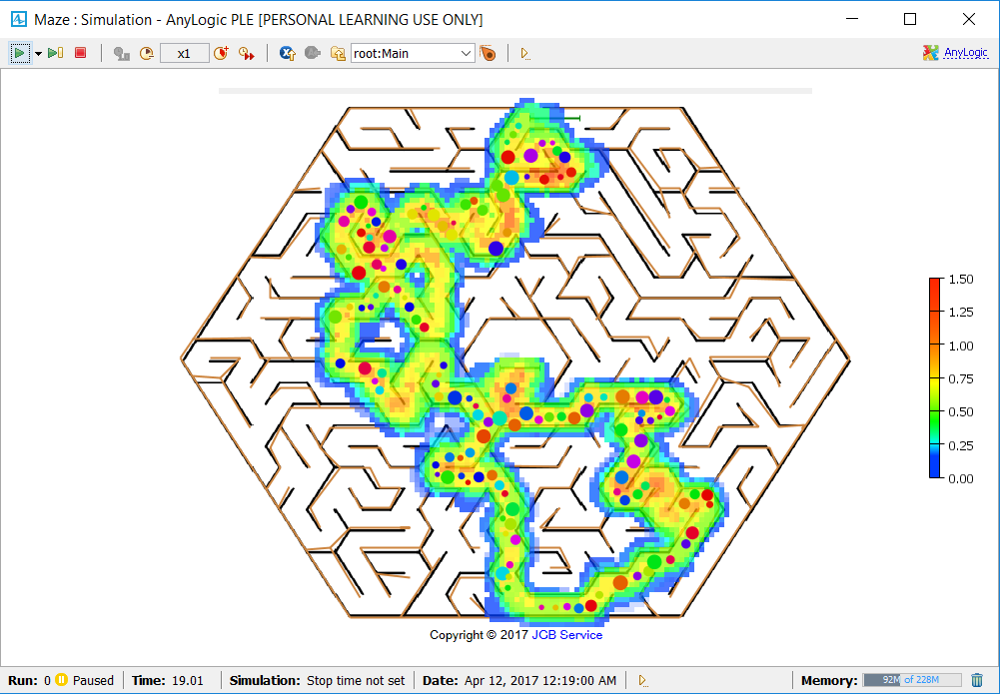

When increasing the entrance rate to 5,000 per minute, the density plot indicates queues start to build up in areas with narrow passages, ref map fig with density below. The most congested area, not taking the entrance area into consideration is in the 3rd quadrant where the passage is rather narrow due to poor tracing of the maze. Similar effect was observed with lower entrance rate and larger size people so the hall ways became relatively more narrow. 

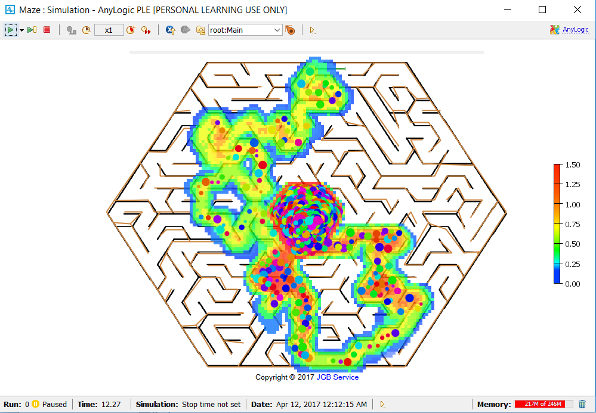

So far, all pedestrians are choosing the same route, the one that leads to the exit as they pass through the maze. In order to diverge pedestrians to some of the dead ends, three pedestrian service areas were placed at three different locations. Pedestrians were directed uniformly distributed to these areas at a rate of .2 each, while the reminding 40% of the pedestrians were routed straight to the exit. This created little changes to the density map except for the expected population of these service areas, ref fig below. The service areas provided service at a uniformly distributed rare.

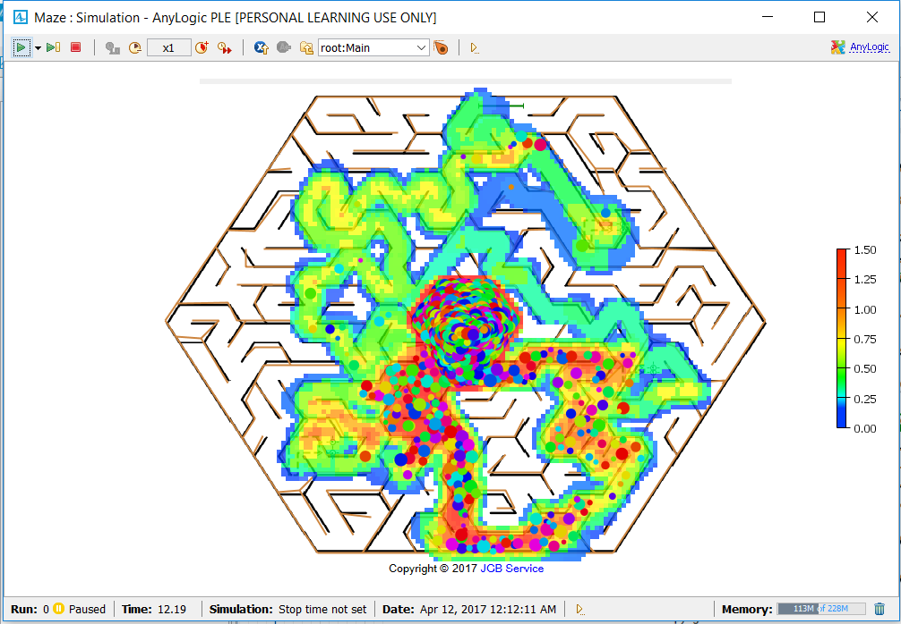. The locations of the service areas are easier recognized in the following figure:

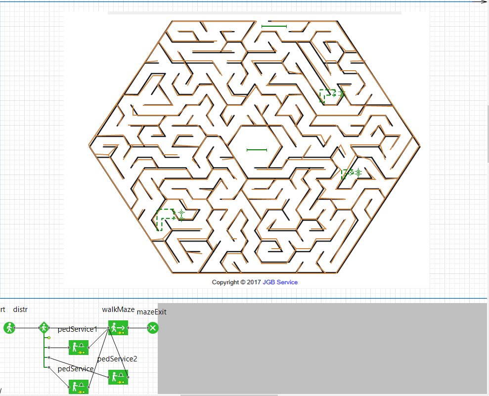

The three service areas were changed to provide service at a Poisson distribution, still receiving the same amount of pedestrians. This resulted in the service areas to start accumulating queues as seen in the density map below:

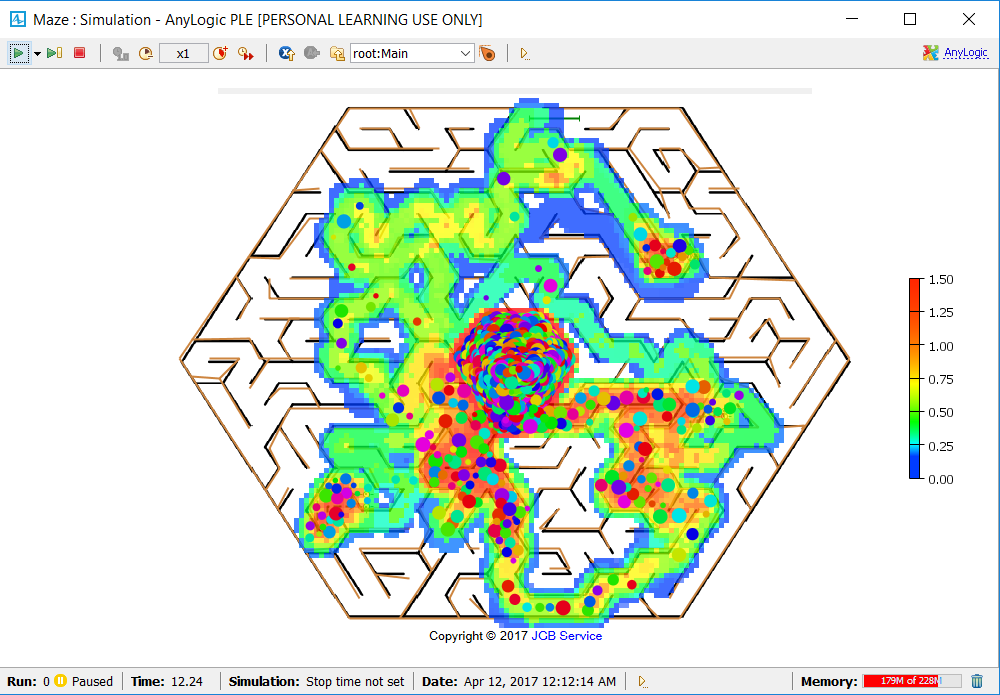

#### (c) Modeling and analysis of the PIII building

One floor of the IST PIII building is modelled using the first floor floor plan. (Dr Wiegand and several of the labs are according to my model on forst floor for the time being.)

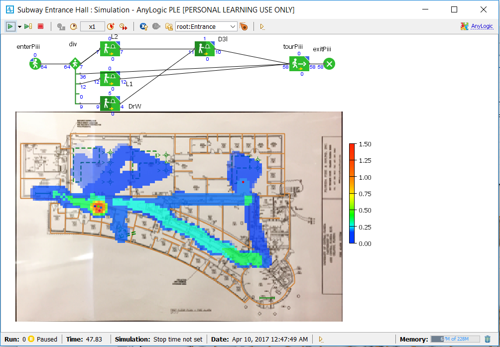

And Dr. Wegand is, according to the density map, close to the hottest spot (printer or coffe machine?). The floor plan is further detailed with six labs located on my version of this floor, L1 - L5 and the 3d Print lab. Lab 1 leas to lab 2 and lab 2 leads to lab 3. Lab 4 and 5 are only accessible through lab 5. The 3D lab is acceccible from the corridor. With 100 people entering the floor per hour uniformly distributed, there are two hot spots identified, one in the narrower part of the hallway outside lab1 enterance, not too far from Dr. Wiegand's office, and the other is closer to the exit, ref. figure below. Looking closer at the floor plan, the hallway is ratehr narrow in that first hot spot area and pedestrians get "tricked into the small office next to the hallway.

After improving the wall recreatin which expanded the hallway, the first hotspot was resolved, ref the 3D image below.

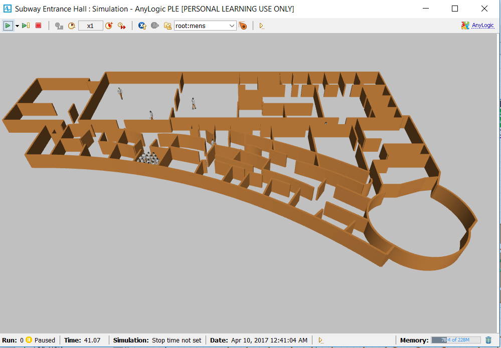

Statistic

The 3D Lab utilization was added, represented by a bar chart, showing a utilization of about 80% on average. This is aout what should be expected as 50% of the pedestrians entering the building was set to visit this lab.

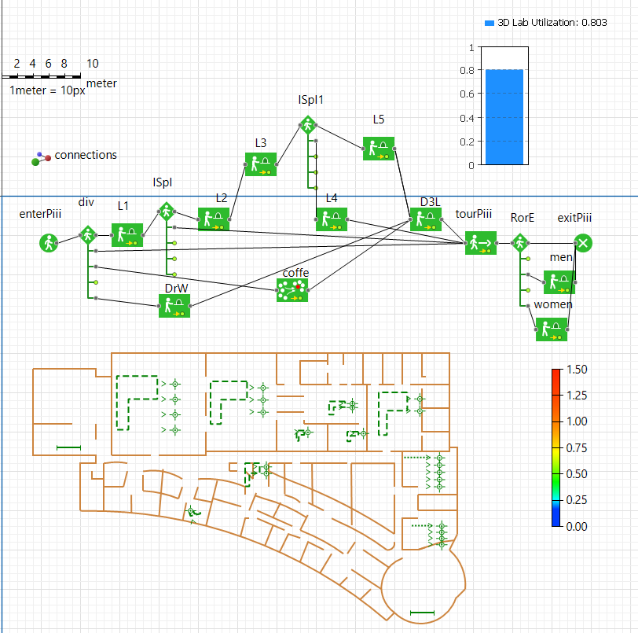

Two additional features were added, a waiting area before entering into the 3D lab and of course, the IDS6938 class as shown in the figure below.

