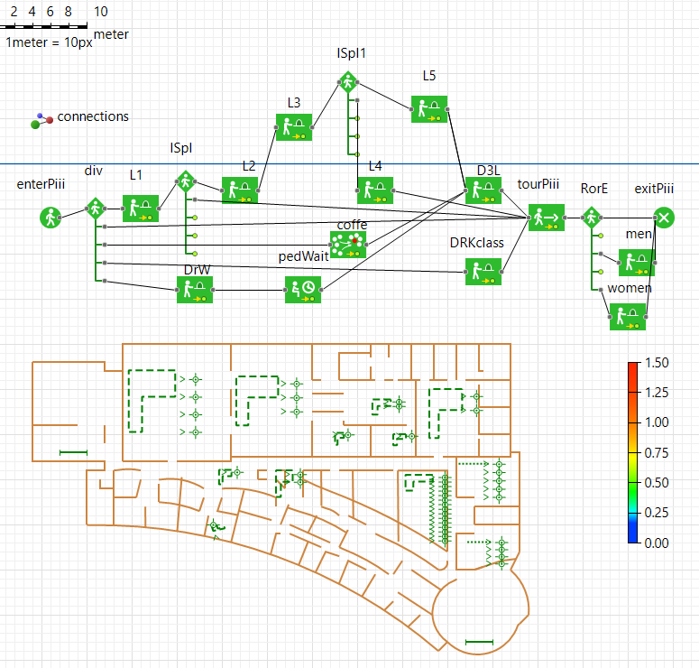
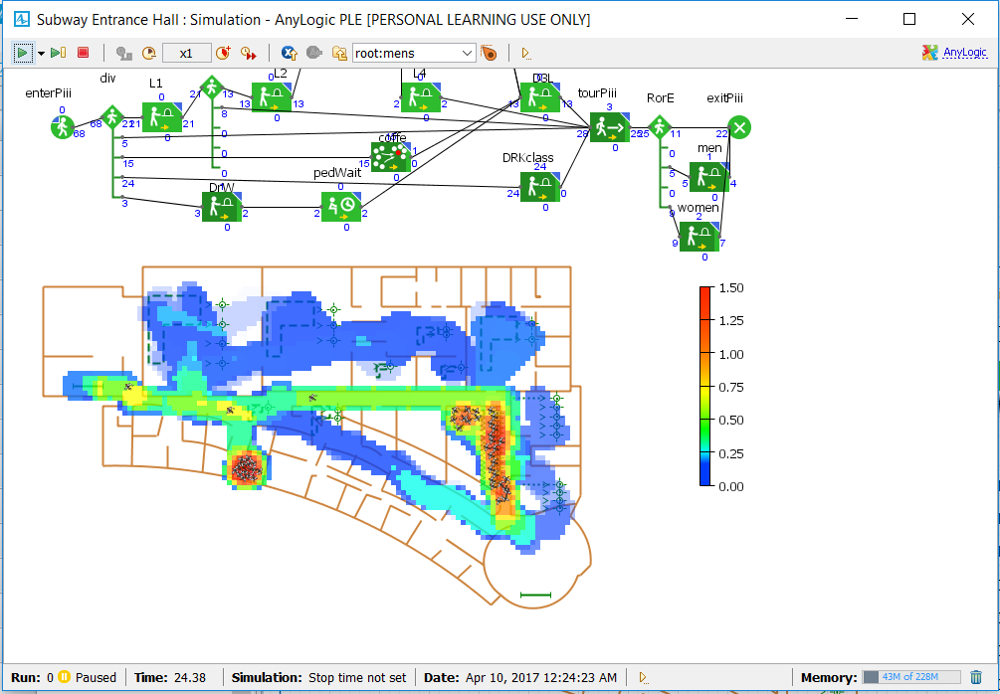
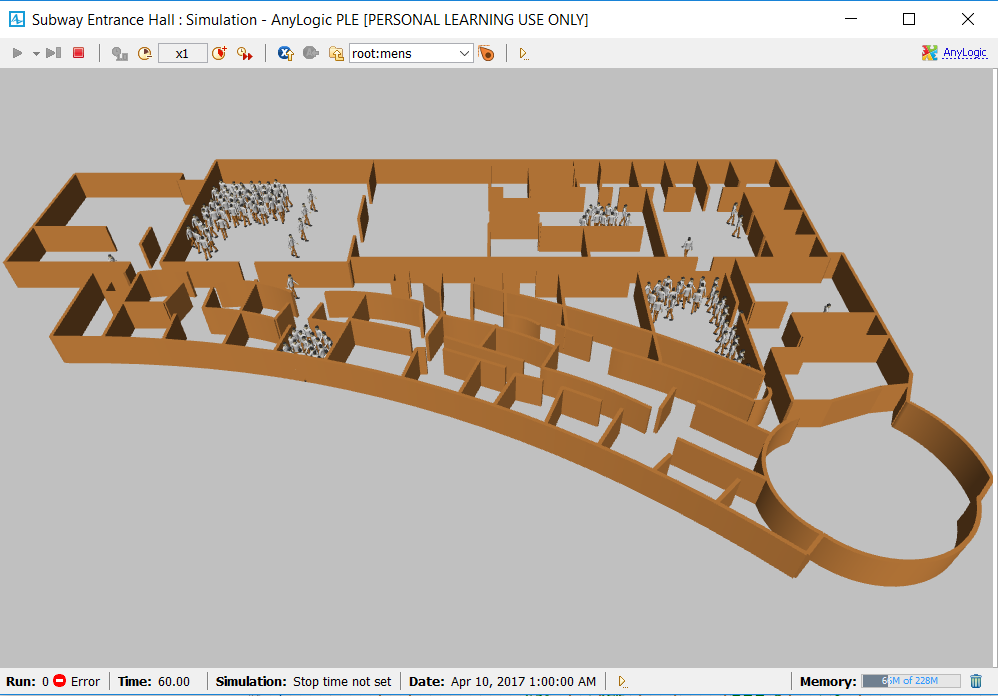
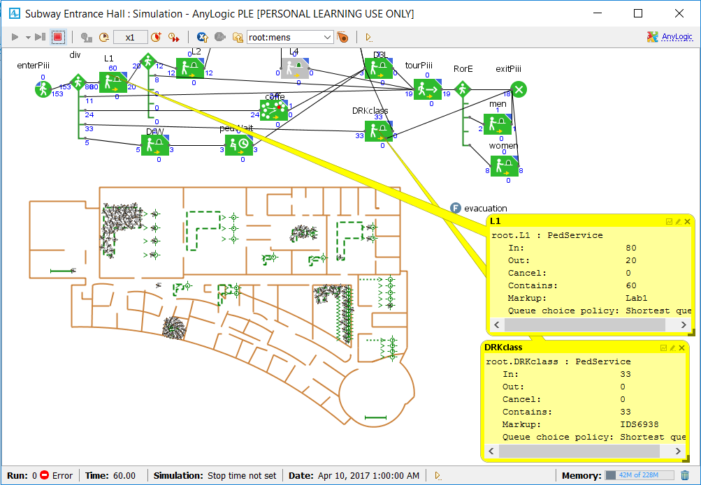

# Homework 3 : Agent based Simulation Assignment

## IDS6938-Simulation Techniques - [University of Central Florida](http://www.ist.ucf.edu/grad/)
by Oddny H Brun

### Part 1 Behaviors

#### (a) Derivative

The derivatives are implemented using Eulers method. The first two, deriv[0] and deriv[1] represent the change in length traveled by the agent per time step, dx/dt = v.  The other two, deriv[2] and deriv[3] are acceleration, the change in velocity per time step dv/dt = force/mass = acceleration for linear and angular movement of the agent, respecitvely. The Euler method seems to give reasonable results in terms of linear movement. I suspect that a higher order method like the midpoint method or the Runge-Kutta 4 method might have given more narrow turns whenever an agent changes direction as well as a more straight walk compared to now where the agent shows tendency to zig-zagging a little. This suspicion has not been checked or attmpted quantified in this work.

The derivative were defined as:

		deriv[0] = state[2];
		deriv[1] = state[3];
		deriv[2] = input[0]/Mass;
		deriv[3] = input[1] / Inertia;

With these definitions for the derivative, only deriv[0] and derv[1] changes as the program execute. Deriv[2] and deriv[3] are constants based on the initial settings for mass, momentum, inertia and calculations of input[0] and input[2]. The agent moves to and from target in a sliding manner without moving its feet. Only a change in these input values would cause changes to deriv[1] and deriv[2].  When deriv[2] is changed by either adding state[2] or vd to it, the agent walks with its legs. In the case of adding state[2], the speed is much slower than when vd is added. In both cases, adding the velocity represented by state[2] or vd is assuming time is one in order to become an acceleration term a=v. 

	deriv[2] = -(input[0] / Mass + vd);

In order to achieve smooth movements, the agents' mass and inertia were adjusted along with force and torque. Too much torque resulted in the agent turning back and forth around its own axix as it walked in the commanded direction. Too high inertia related to torque resulted in wider turns as it was circling around target in a seek as wellas when changing directions due to changing behaviors. I settled at torque per inertia of 8/6, a force per mass of 9/1.75, and velocity Kv of 3. Force/mass and velocity was increased and decreased to increase/decrease the walking speed of the agent.

#### (b) Individual behaviors

Seek

Seek was implemented by calculating the desired velocity between agent's current position, GPos, and its target, goal, and desired angle, thetad, which is the angle between current velocity and desired velocity to find the steering velocity, the correction needed in order to react target. When executing, the agents seek the target, and when reaching the target, they continue to move in circles around the target. They also respond to the target being moved by seeking the target in its new location.

Flee

Flee was impleented by the same algorithm as for seek, except for adjusting the desired angle thetad by 180degrees. When executed, the agents walk away from target and continue to walk until reaching the edge of the flat "earth". They also respond to the target being moved by changing direction if new target gets located in front of where they were fleeing.

Arrival

The algoritm for arrival is equal to the seek algorithm until the agents come within a set distance from the target, Aradius. Then the agents'sped is slowed dovn by a factor of either KArrival or a factor calculated as its distance Adist divided by 2 times its Aradius, Adist/(2*Aradius). The facor 2 was just to achieve a slower approach than just Adist/Aradius. When executed, the agents behave as for seek behavior until they are a distance Aradus from the target, then they slow dovn as they continue to approach the target. They respond to target being moved by seeking the new target location at "full" speed when further than Aradius away and slow down when being less than a distance Aradius from the target. If behavior is changed to different mode they resume the speed and direction equivivalent for that behavior. Currently, the Aradius is set to 300.

Departure

The algorithm for departure follows the same princilpes as for arrival except for the agetns' speed being reduced as the agents have moved a given distance away from the target. Currently, the distance is set to a radius, Dradius of 1200. when executed, the agents behave like for flee until they reach a distance Dradius from the target, then they slow down by a factor of Ddist/(2*Dradius). The respond to target movement accordingly by  resuming "full speed" fleeing the new target until they are a distance Dradius frorm the target, then they slow teh speed down by teh factor Ddist/(2*Dradius).

Wander

The agent behavior wander was implemented as flee, execpt for the desired angle thetad being randomly created by a uniform distribution on [0, 360] times a noise factor, Knoise. When executed, the agents will change their direction in a seamingly random manner, but this random adjustment is only done once as opposite to having the agents randomly change their directions repetitively without selecting wander repetitively. Their velocity is adjusted by multiplying desired velocity vd by a factor KWnder. All agents wander off in the same direction as the same thetad value is used for all. If time allows, I plan to generate different thetad for each agent. Their behavior is not responding to the target as thetad is independent of the target.

Obstacles

Approach:
- find number of obstales (obstacleNum)
- for each obstacle, find obstacle x and y location and radius (env->obstacles[i][0], env->obstacles[i][1]) and (env->obstacles[i][2]) and check if "cylinder corridor" along the direction of movement is clear
- take corrective action when "cylinder corridor" is not clear.

Cylinder corridor (that is, it is a rectangle bc. this agent moves in 2D, not 3D) is found by calculating the formula of the straight line between agent's location, GPos, and its goal, goal. A radius of length "radius" is added to both sides in x and y direction (this results in the actual radius, the hypotenus, to be a little bigger than the radius specified) of the straight line to define the corridor. Then for each obstacle we check if any area of the corridor is within the obstacle's footprint described by its radius. I check in both x and y direction along the direction of travel. This is conducted by using the x and y position of the obstacle's center and compare to x and y values around that location, using the equation for a circle:

(x-x_a)^2 + (y-y_a)^2 = (r_O)^2, where x_a, y_a and r_a are obstacle x and  y locations, and radius, respectively.

This check is  If obstacle is within corridor, I decrease or increase the angel thetad, respectively. Right now, this angle correction is set to + M_PI/2 if obstacle is in y direction, or -M_PI/2 if in x direction which should be large enough for the one obstacle in consideration. But this factor may be calculated based on the locations of all obstacles within the existing or future corridoes.

Status: Used obstacle no 1 as it is locaed at the first time "Avoid" behavior is selected and found it to be within the agent's corridor. In order to test the algorithm I had to play around a little by going back and forth between different behaviors in order to "hit" a setting where an obstacle was located in the agent's path. As the agent approached the obstacle, it made a right 90 degree correction and avoided the obstacle. I am aware that this is not the ideal way to check the correctness of this algorithm. Hopefully, I can get to the next step as described in the following paragraph.

The idea is to expand this algorithm in a double "for loop" that runs through all the obstacles for all agents. If time allows, I will implment this part as well. The principles will be the same, just making sure all agents' corridors are checked for all obstacles, and desired angle thetad is adjunsted to avoid collision. 

#### (c) Agent Group Behavior

Separation

Step one: Identify other agents within radius of "RNeighborhood" of a specific agent.

I pick agents[0] to be my agent and usees its location to check for the other within a radius of RNeighborhood. This was implemented as a for loop running through all agents (SIMAgent::agents.size(), starting with agents[1] as nr 0 was the one I picked for separation. The distance was calculated as a two dimensional vector representing the distance between agent 0's GPos and each of the other agents' GPos. If the lengt of this vector was less than the RNeighborhood, agent's tmp = (agent's goal - GPos) was normalized and cumulated for each agent within the RNeighborhood. This cumulative distance measure was used to calculate a new thetad degrees for agent 0 to separate from the neighboring agents.

At first when executing the program with a radius, RNeighborhood, of 3.0 and 14 agents, the separation appeared like flee. By increasing the radius to 70. the separation was noticable. One agent clearly seperates away from its nearest agents. As should be expected, the separation effect only takes place if other agents are present in agents[0]'s neighborhood. The separation effect is even easier observed with many agents (60 agents) in an arrival formation as the separation command is initiated.

Allign

For the allignment algorithm I calculate an normalized sum of desired velocity for all agents (similar to the separate algorithm for the agents that were within the RNeighborhood distance from the separating agent), and use this as the desired velocity for all agents. When executed, they all walk off in the same direction. If target gets moved up in front of where they are heading, they turn around and walk off in the same direction. With this allignment algorithm the agents do not line up in a straight line, but they do head in the same direction.

Leader Following

Follw the leader is implemented using the same algorithm as for allign combined with slowing down the speed of agents in front of the leader until they get behind the leader, then they resume the same speed as the leader. When executed, all agents walk off in the same direction as under allignment. In addition, the agents that are in front of the leader slow down until the leader is in front. Then they resume same speed as the leader. As under allignment, the agents do not line up in  a straight line behind the leader, but they do follow behind the leader, heading in the same direction as the leader.

Cohesion and Flocking not in yet.

### Part 2 - Simulating a simple pedestrian flow

#### (a) Subway Enterance

The subway enterance example was created with boundaries, walls, entrance and exit, including faregates before exit to train as shown in the figures below for entrance rate of 1000 per min.

Adding 3d,

And adding faregates, displayed with density map,

The entrance frequency was increased to 14,000 per minute and the back up and lines were visible as demonstrated in the below two figures:

#### (b) Maze

I coipied a maze from www.mazegenerator.net and traced it. The pedestrians are entering at a rate of 1,000 per minute and exiting without showing any area of congestion (queue). The belonging density map is shown in the below figure,

When increasing the entrance rate to 5,000 per minute, the density plot indicates queues start to build up in areas with narrow passages, ref map fig with density below. The most congested area, not taking the entrance area into consideration is in the 3rd quadrant where the passage is rather narrow due to poor tracing of the maze. Similar effect was observed with lower entrance rate and larger size people so the hall ways became relatively more narrow. 

So far, all pedestrians are choosing the same route, the one that leads to the exit as they pass through the maze. In order to diverge pedestrians to some of the dead ends, three pedestrian service areas were placed at three different locations. Pedestrians were directed uniformly distributed to these areas at a rate of .2 each, while the reminding 40% of the pedestrians were routed straight to the exit. This created little changes to the density map except for the expected population of these service areas, ref fig below. The service areas provided service at a uniformly distributed rare.

. The locations of the service areas are easier recognized in the following figure:

The three service areas were changed to provide service at a Poisson distribution, still receiving the same amount of pedestrians. This resulted in the service areas to start accumulating queues as seen in the density map below:

#### (c) Modeling and analysis of the PIII building

One floor of the IST PIII building is modelled using the plan for the first floor and modify its content to facilitate Dr Wiegand and several of the labs from the second floor. The scenario is to test the pedestrian flow and focus on heavy traffic areas as well as areas that have indirect access from the hallways. Such areas are Labs 2, 3, 4 and 5. A pedestrian can only get to lab2 via lab 1. Lab 3 can only get accessed through lab 1 and 2. Lab 4 and 5 can only get accessed through lab 3. Of the labs, only the 3D lab has direct access from the hall way. 

The scenario is analysed by steady flow of pedestrians entering and exiting the area to observe any hotspots, some utilization statistics as well as an evacuation simulation.

And Dr. Wegand is, according to the density map, close to the hottest spot (printer or coffe machine?). The floor plan is further detailed with six labs located on my version of this floor, L1 - L5 and the 3D Print lab. Lab 1 leas to lab 2 and lab 2 leads to lab 3. Lab 4 and 5 are only accessible through lab 3. The 3D lab is acceccible from the corridor. With 100 people entering the floor per hour uniformly distributed, there are two hot spots identified, one in the narrower part of the hallway outside lab1 enterance, not too far from Dr. Wiegand's office, and the other is closer to the exit, ref. figure below. Looking closer at the floor plan, the hallway is ratehr narrow in that first hot spot area and pedestrians get "tricked into the small office next to the hallway.

After improving the wall recreatin which expanded the hallway, the first hotspot was resolved, ref the 3D image below.

The full model

The model is expanded to include a classroom for IDS6938, a waiting are outside Dr. Wiegand's office and a group assemble representing the coffe/small kitchen area. The model is shown in the following figure:

Statistic

Before the IDS6938 class was added, most of the traffic went to the 3D lab and the lab utilization , represented by a bar chart, shows a utilization of about 80% on average. This is aout what should be expected as 50% of the pedestrians entering the building was set to visit this lab. In it self, this number does not tell too much, but if we let the pedestrians repreent clients coming for 3D printing services, we could use this number to evaluate technical and economical efficiency as well as potential for improvements, in which case, a 20% idleness migh be rather high.

The utilization statistics for 3D lab is one example of information available for all the service areas in this model. Similar statistics and additiaonal information is available in Anylogic,including custom progrmming options. The quality of this information depends on realistic setting of the parameters for the model, such as arrival time, wait time, service time and their distribution. In a future applicaton the effort to acquire such information would be highly prioritized.

Looking at the current model, with a coffe area, a waiting area added before entering into the 3D lab, and the IDS6938 class included, another density map were created. Also, for the IDS class, the delay time distribution is changed from uniform to Poisson(21). Under otherwise similar conditions, using a Poisson distribution seems to create a less smooth flow compared to the uniform (this is not further quantified here). The number of pedestrian entering into the floor is 150 per hour. The percentage of these heading to SimTech class is set to 1/3, i.e. 50. The density map measures pedestrians per square meter. As displayed in the figure below, the SimTech class seem to be pretty popular as it forms a hot spot with density reaching 1.5 persons per square meter.

Evacuation evaluation

After one hour 153 pedestrians had entered the piii building and 18 had exited, leaving 135 inside the building. These were located

- Lab 1 - 5: 80 pedestrians
- Dr Wiegand's office: 2
- Dr Kider's class: 33.

Of the remaining 20 ( = 135 - 115) some were in the 3D lab, some in the coffe area, some in the restroms and some in the hallways as shown in the 3d figure of the simulation below.

The big part of the number are verified in the following snapshot:

I defined an evacuation function but did not succeed in getting it to execute. But by doing the math manually, we find that there are 135 pedestrians that need to leave the building immediately after evacuation order is given. We assume they only can exit through the "exitPiii" exit. If all these 135 did reach the passage out to the circular area about the same time, it would create a servere queue. This passage is, according to my layout, about 90 cm wide (which happens to be the width of my home front door, and most likely not up to code for a building like piii). The circular area located immediate before the exit is about 78 square meters. So worst case senario would be 135 pedestrians in an 78 sqare meter area, that is about 1.7 pedestrians per sqare meter. That in itself might be manageable. 

Taking into consideration two factors:

- about 80 of the pedestrians are all the way in the other end of the building and will us more time to reach the exit than the ones closer by the exit, given that everyone respond immediately to the evacuation order.
- the passage leading out to the circular area is in reality a double door far wider than on the floorplan used in this simulation

it is more likely that the pedestrians per square meter would be less than 1.7.

In real life one question would be how fast this area needs to be emptied out? Is there an explosion about to happen near by that is expected to harm anybody stuck in this area, or is it a less servere cause for evacuation? 

The reality of this evacuation analysis would have to be evaluated based on different critereias. Some of these criteria are: 

- max time to empty the building, 
- pedestrains response time when evacuation order is issued, 
- true bottle necks along the evacuation route
- exit capacity for the available exits in the evacuation route.

An up-and-running evacuation function would be of value to simulate different evacuation scenarios and evaluate potential actions nedded if worst case scenario was not acceptable.

